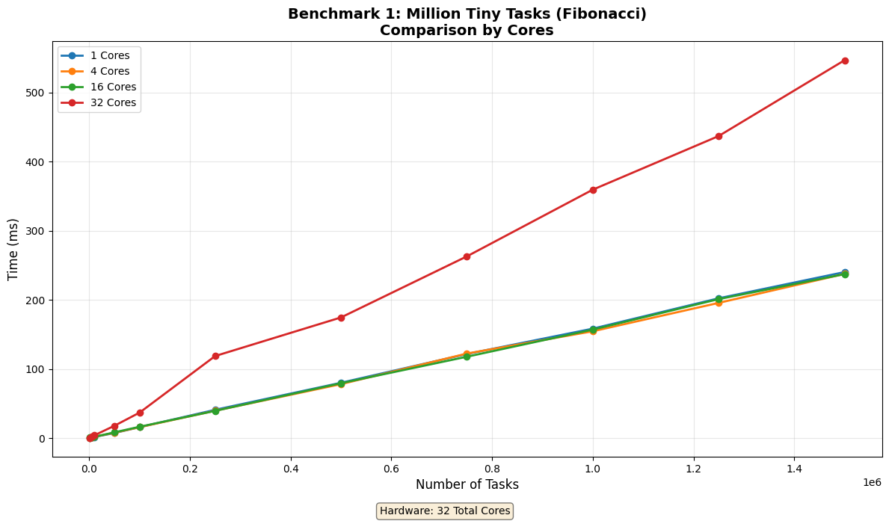
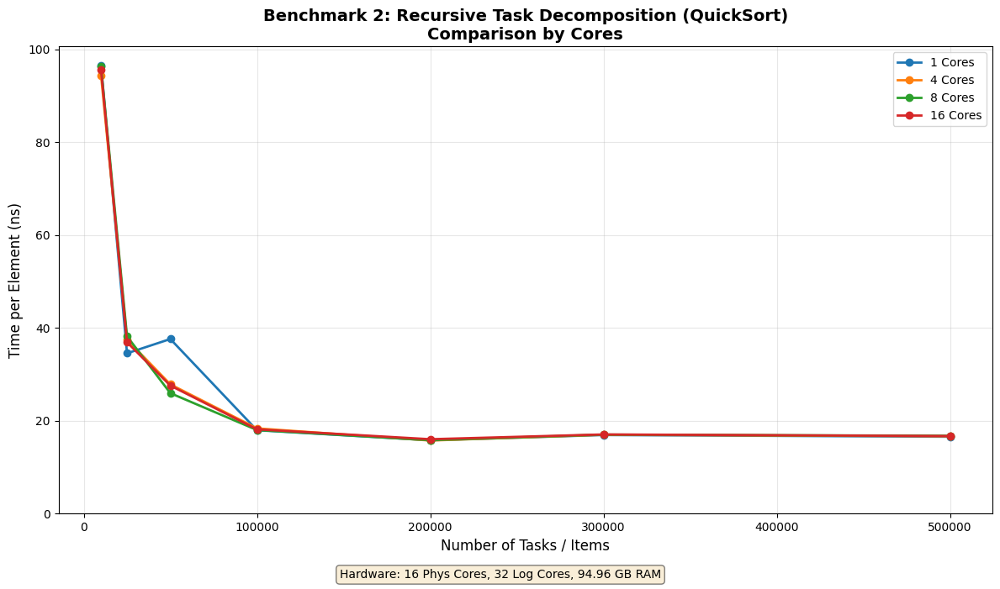
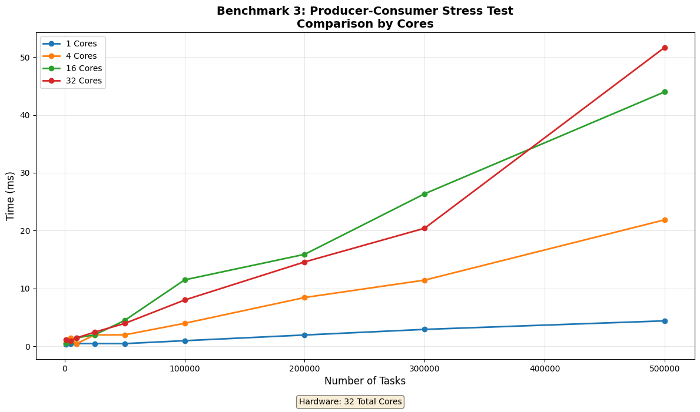
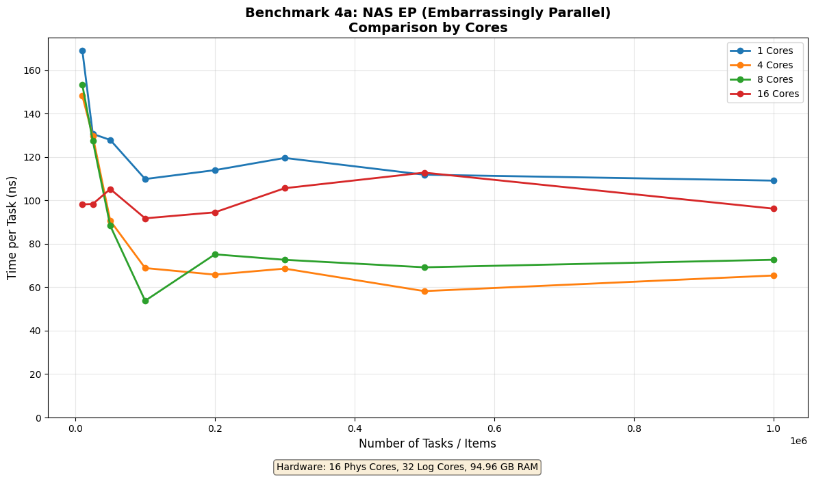
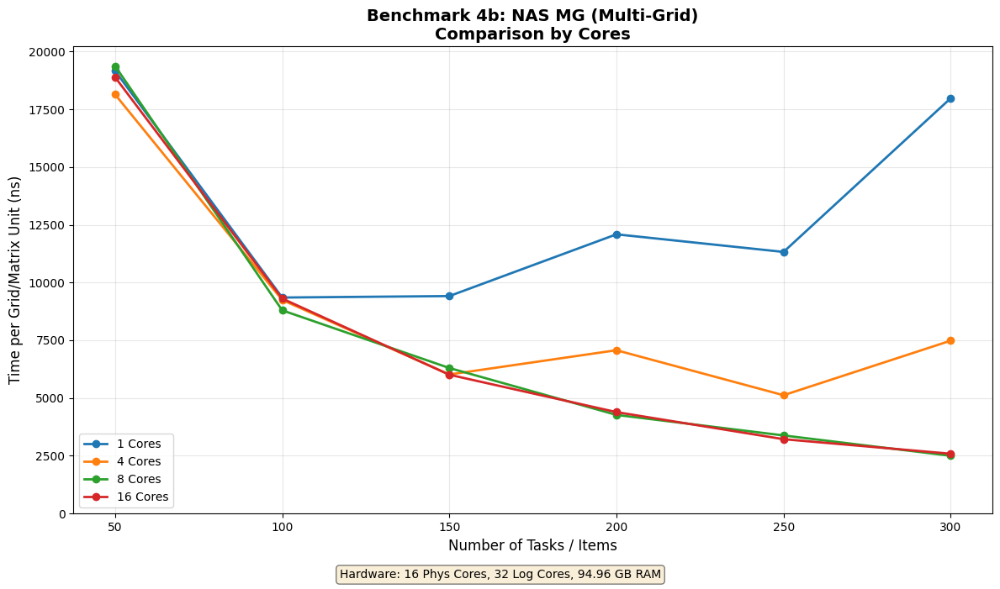
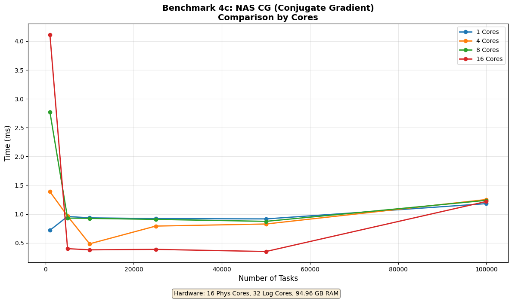

# RustFiber Benchmarks

This directory contains benchmark scripts that test the RustFiber job system with various stress tests, now optimized with thread pinning strategies.

## Benchmarks

1. **Million Tiny Tasks (Fibonacci)** - Tests task creation latency and scheduler efficiency with 1M+ tiny jobs
2. **Recursive Task Decomposition (QuickSort)** - Tests work-stealing efficiency with recursive job spawning
3. **Producer-Consumer Stress Test** - Tests throughput under high lock contention
4. **NAS Parallel Benchmarks** - Real-world computational efficiency tests:
   - EP (Embarrassingly Parallel) - Pure throughput with zero communication
   - MG (Multi-Grid) - Communication and memory bandwidth
   - CG (Conjugate Gradient) - Irregular memory access patterns

## Running Benchmarks

### With Python (uv recommended)

The benchmark runner supports selecting a **Pinning Strategy** and automatically iterates through common core counts (**1, 4, 16, 32, 64, 96**), skipping any that exceed the system's capacity.

```bash
# Using uv (recommended)
uv run run_benchmarks.py [strategy]

# Examples:
uv run run_benchmarks.py linear          # Worker i -> Core i (Default)
uv run run_benchmarks.py --compare-cores # Compare Linear across core counts
uv run run_benchmarks.py --compare-strategies # Compare strategies on high cores (>=16)
uv run run_benchmarks.py avoid-smt      # Physical cores only
```

### Modes

1.  **Single Run**: `uv run run_benchmarks.py [strategy] [thread_count]`
    - Generates a standard graph for a specific configuration.
2.  **Core Comparison**: `uv run run_benchmarks.py --compare-cores`
    - Uses the `Linear` strategy.
    - Compares 1, 4, 16, 32, 64, 96 cores (skipping those not supported).
    - Generates `comparison_cores_[NAME].png` with a line for each core count.
3.  **Strategy Comparison**: `uv run run_benchmarks.py --compare-strategies`
    - Runs only on systems with 16+ cores.
    - Uses the maximum physical core count.
    - Compares `none`, `linear`, `avoid-smt`, `ccd-isolation`, `tiered-spillover`.
    - Generates `comparison_strategies_[NAME].png` with a line for each strategy.

The script will:
1. Build and run the Rust benchmark binary for each target core count.
2. **Core Safety**: Only runs core counts supported by the current hardware.
3. **Stream results**: JSON data is processed line-by-line as benchmarks complete.
4. **Incremental Graphing**: PNG graphs are generated immediately after each test.
5. **Timeout**: Each benchmark has a strict **1-minute timeout** to prevent hangs.

### Manual Execution

You can also run the Rust benchmarks directly for a specific strategy and thread count:

```bash
cargo run --bin benchmarks --release -- [strategy] [thread_count]
```

## Output

The benchmarks generate PNG graphs in `docs/` with descriptive filenames:
Format: `benchmark_[NAME]_[CORES]c_[RAM]gb_[STRATEGY].png`
Comparison Format: `comparison_[MODE]_[NAME].png`

## Comparison Results

### Core Scaling Comparison (Linear Strategy)
These graphs show how performance scales from 1 to 32 cores.

| Fibonacci | QuickSort |
|-----------|-----------|
|  |  |

| Producer-Consumer | NAS EP |
|-------------------|--------|
|  |  |

| NAS MG | NAS CG |
|--------|--------|
|  |  |

### Strategy Efficiency Comparison (32 Cores)
These graphs compare different pinning strategies on a multi-core system.

| Fibonacci | QuickSort |
|-----------|-----------|
|  |  |

| Producer-Consumer | NAS EP |
|-------------------|--------|
|  |  |

| NAS MG | NAS CG |
|--------|--------|
|  |  |

## Requirements

- Rust (for building the benchmark binary)
- Python 3.8+ (for graph generation)
- matplotlib (Python package)
- sysinfo (Rust crate, for hardware detection)

Install Python dependencies:

```bash
# With uv
uv pip install matplotlib

# Or with pip
pip install matplotlib
```
