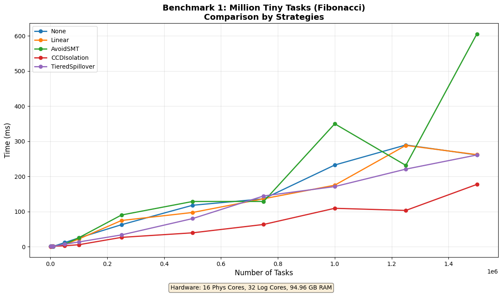
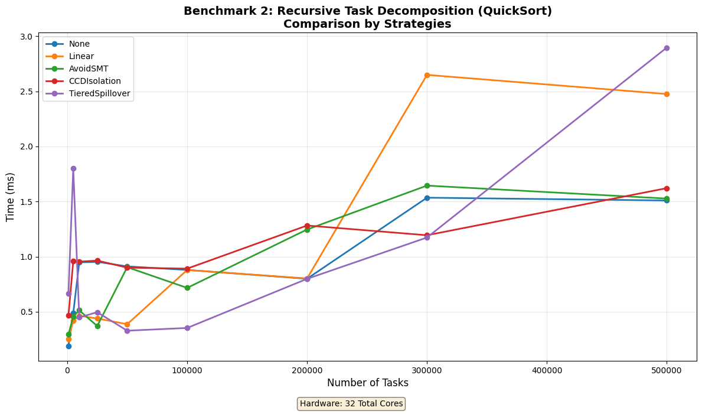
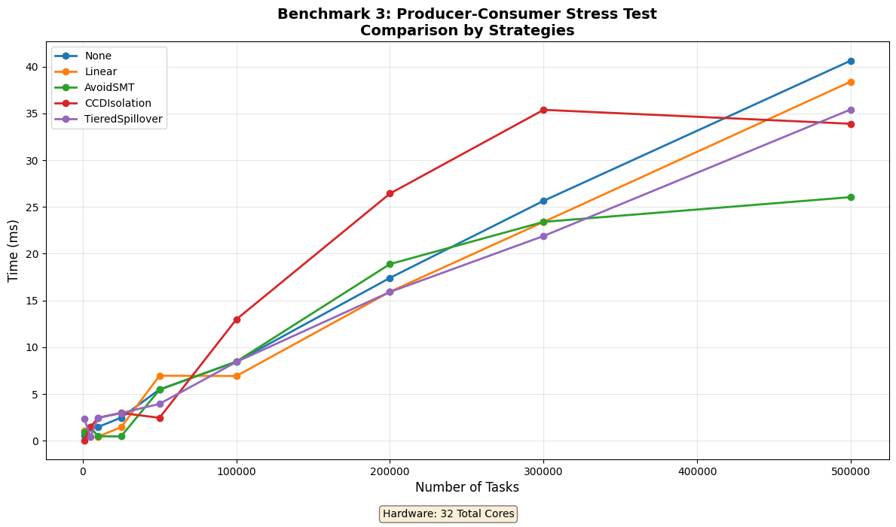
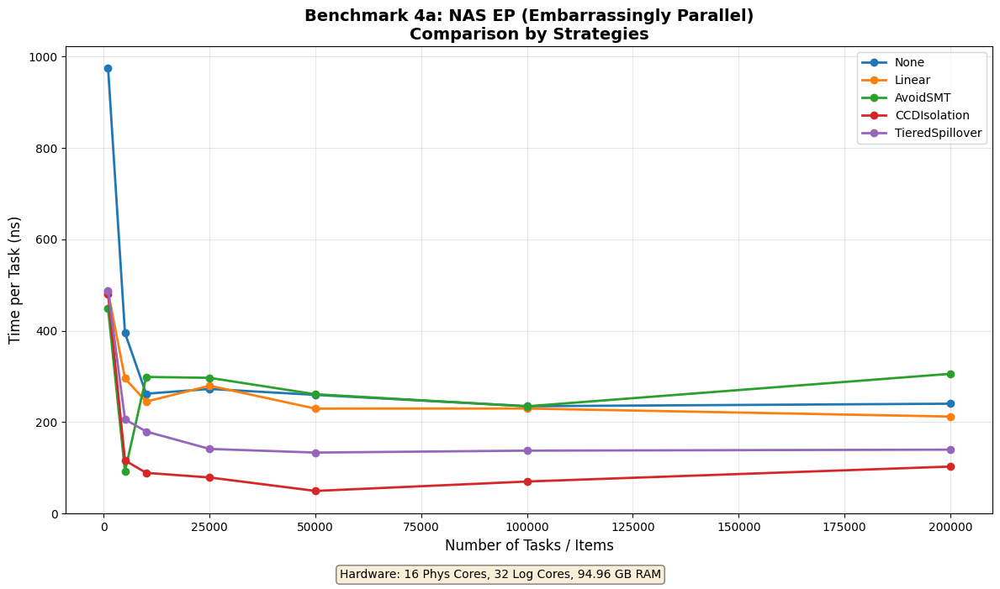
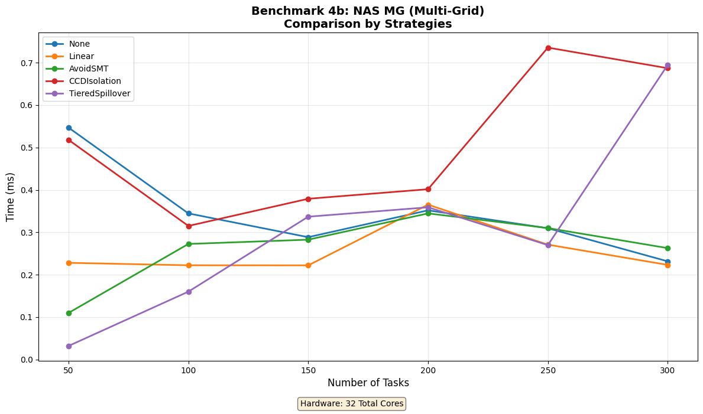
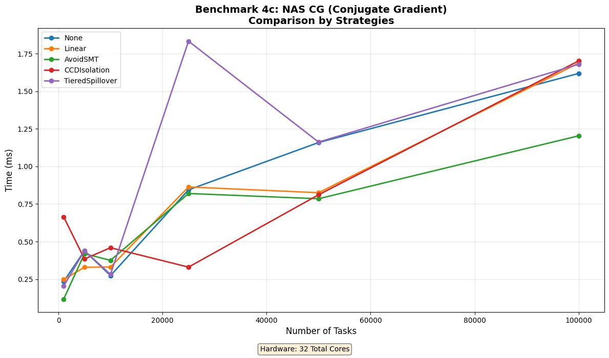

# RustFiber

[](https://github.com/josephkirk/RustFiber/actions/workflows/ci.yml)
[](https://github.com/josephkirk/RustFiber/actions/workflows/docs.yml)

A high-performance fiber-based job system implementation in Rust, following the architectural principles from Naughty Dog's engine parallelization work.


## Features

- **Parallel Job Execution**: Efficiently schedule work across multiple CPU cores
- **Nested Parallelism**: Jobs can spawn child jobs using Context for recursive decomposition
- **Counter-Based Synchronization**: Track job completion without blocking
- **Thread-Safe**: Built on Rust's ownership model and proven concurrency primitives
- ✅ **High Throughput**: Capable of millions of jobs per second
- ✅ **Simple API**: Easy to use interface for job submission and synchronization

## v0.2 Optimizations (New)

- **Stack Reuse**: Eliminated `mmap` overhead by recycling fiber stacks.
- **Adaptive Spinning**: Reduced latency for fine-grained dependency chains.
- **Strategy-Aware Scheduling**: Hybrid Local/Global scheduling to optimize for both cache affinity (`Linear`) and load balancing (`TieredSpillover`).

## Quick Start

```rust
use rustfiber::JobSystem;

// Create a job system with 4 worker threads
let job_system = JobSystem::new(4);

// Submit a job
let counter = job_system.run(|| {
    println!("Hello from a job!");
});

// Wait for completion
job_system.wait_for_counter(&counter);
job_system.shutdown();
```

### Nested Parallelism with Context

```rust
use rustfiber::JobSystem;

let job_system = JobSystem::new(4);

// Jobs can spawn child jobs for recursive decomposition
let counter = job_system.run_with_context(|ctx| {
    // Subdivide work across multiple child jobs
    let mut counters = vec![];
    
    for i in 0..4 {
        let child = ctx.spawn_job(move |_| {
            println!("Child job {} running", i);
        });
        counters.push(child);
    }
    
    // Wait for all children to complete
    for child in counters {
        ctx.wait_for(&child);
    }
});

job_system.wait_for_counter(&counter);
job_system.shutdown();
```

## Building

```bash
cargo build --release
cargo test
cargo run --release
```

## Documentation

See [ARCHITECTURE.md](ARCHITECTURE.md) for detailed documentation on the design, implementation, and usage.

See [BENCHMARKS.md](BENCHMARKS.md) for information about running performance benchmarks.

### Benchmarks

Run comprehensive performance benchmarks:

```bash
# Using Python with uv (recommended)
uv run run_benchmarks.py

# Or with regular Python
python3 run_benchmarks.py
```

This will test the system with:
1. **Million Tiny Tasks (Fibonacci)** - Task creation and scheduling efficiency
   
2. **Recursive Task Decomposition (QuickSort)** - Work-stealing efficiency
   
3. **Producer-Consumer Stress Test** - Throughput under contention
   
4. **NAS Parallel Benchmarks** - Real-world computational patterns (EP, MG, CG)
   
   
   

Benchmark results and graphs are saved to the `docs/` folder.

## Performance

Typical performance on modern multi-core systems:
- 6+ million jobs/second throughput
- Sub-microsecond latency for simple jobs
- Efficient CPU utilization across all cores

## License

MIT
