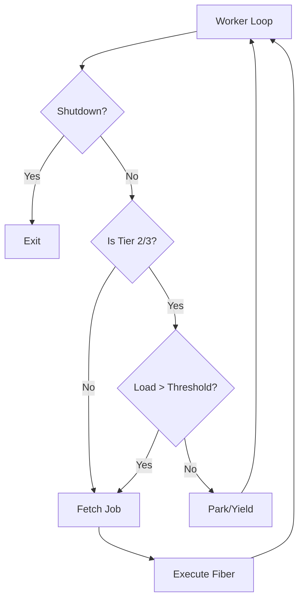

# Design: Tiered Spillover System

This document outlines the architectural changes required to implement dynamic core scaling in the RustFiber job system.

## 1. Load Tracking
The system needs a real-time (or near real-time) metric of worker saturation.
- **`active_workers`**: An `AtomicUsize` shared between all workers and the pool.
- **Worker Lifecycle**: 
    - Increment `active_workers` before calling `fiber.run()`.
    - Decrement `active_workers` immediately after.
    - *Correction*: The decrement should happen *after* a worker fails to find work in its local queue and the injector, but *before* it starts yielding/parking if we want to measure "demand". However, the simplest way is to track currently executing threads.

## 2. Tier Definitions
Based on Zen architecture (e.g., Ryzen 5000/7000 series):

| Tier | Group | Logical IDs (Assumed) | Threshold (on 16c/32t) |
|------|-------|-----------------------|-------------------------|
| 1    | CCD0 Physical | 0, 2, 4, 6, 8, 10, 12, 14 | 0 (Always Active) |
| 2    | CCD1 Physical | 16, 18, 20, 22, 24, 26, 28, 30 | > 6 Active Workers |
| 3    | SMT Sibling | 1, 3, 5, ..., 15, 17, ... | > 14 Active Workers |

## 3. Worker State Machine
Workers in Tiers 2 and 3 will have an additional check in their `run_loop`:

## 4. Spillover Logic Implementation
- **Worker Structure**: Add `tier: u8` and `threshold: usize`.
- **WorkerPool**: When submitting a batch of jobs, if the backlog is high, the pool can `unpark` dormant workers. However, for a simple start, workers can just use a `yield_now()` or a short `sleep` if their tier is not "active" to minimize CPU usage while staying responsive.

## 5. Core Mapping Implementation
The `WorkerPool::new_with_strategy` will be updated to categorize `CoreId`s into tiers:
1. First 8 even IDs -> Tier 1.
2. Next 8 even IDs -> Tier 2.
3. All odd IDs -> Tier 3.
(This assumes the standard Windows/Linux core numbering where physical/SMT alternate or are grouped).
