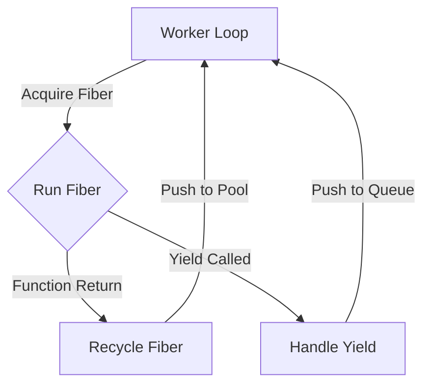

# Core Fiber Switch Design

## Architecture

We are moving from a "Fiber = Job Wrapper" model to a "Fiber = Execution Context" model.

### 1. The Fiber Stack
We will use the `corosensei` crate which provides a safe-ish wrapper around context switching assembly.

```rust
pub struct Fiber {
    coroutine: Coroutine<Job, (), ()>,
}
```

### 2. The Scheduler Loop (State Machine)
The worker thread operates the scheduler.



### 3. Fiber Pool
To avoid allocation overhead, fibers are pooled.

```rust
pub struct FiberPool {
    pool: SegQueue<Fiber>,
}
```

### 4. Yielding Mechanism
The `Context` struct needs access to the `yielder` provided by `corosensei`. This is tricky because `Context` is passed *into* the job. We might need thread-local storage or a specific argument structure to pass the yielder down.

**Proposed Approach**:
Since `corosensei` passes the yielder to the closure, we can wrap the user's `Job` closure in an internal closure that captures the yielder and exposes it via `Context`.

```

### 5. Intrusive Wait List
To support zero-allocation waiting, we embed the wait node in the Fiber.

```rust
#[repr(C)]
pub struct WaitNode {
    pub next: AtomicPtr<WaitNode>,
    pub fiber_handle: FiberHandle, // or similar identifier
}

pub struct Fiber {
    coroutine: Coroutine<Job, (), ()>,
    pub wait_node: UnsafeCell<WaitNode>, // Embedded node
}

pub struct AtomicCounter {
    value: AtomicUsize,
    wait_list: AtomicPtr<WaitNode>, // Head of the lock-free stack
}
```

**Wait Logic**:
1. `wait_for_counter` pushes the current fiber's `wait_node` onto the `AtomicCounter`'s `wait_list` (Treiber stack push).
2. The fiber yields.

**Wake Logic**:
1. When counter hits zero, it `swap`s the `wait_list` head to null (claiming all waiters).
2. The claiming thread iterates the list and pushes all grabbed fibers back to the scheduler (Batch Wake).
